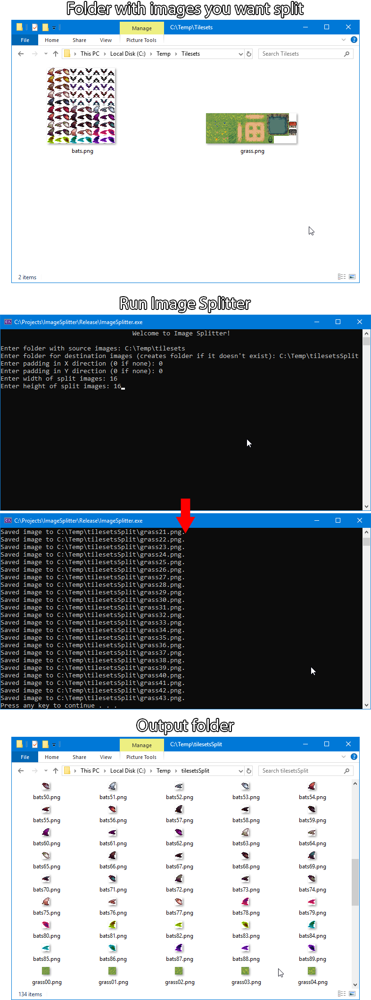

# ImageSplitter
A simple image splitter made with C++17 and [SFML](https://www.sfml-dev.org/). Currently only works with Windows.

Download executable by clicking on the [release tab](https://github.com/MatthewJulian/ImageSplitter/releases) above.

# Sample

